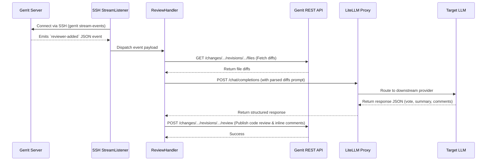

# Gerrit Auto Code Review Bot

A Python-based bot that connects to a Gerrit server's SSH event stream, listens for the `reviewer-added` event, fetches the patchset details, and runs automated code reviews using an LLM (Language Model) via a [LiteLLM](https://litellm.ai/) proxy.

## Features

- **SSH Stream Listening:** Subscribes to the Gerrit `stream-events` firehose and reacts only when the bot system account is explicitly added as a reviewer.
- **REST API Integration:** Securely fetches unified patchset diffs and posts both overall review summaries and inline comments.
- **LLM Agnostic:** Uses the LiteLLM proxy as a bridge. You can easily hot-swap providers (OpenAI, Anthropic Claude, Google Gemini, local ollama, etc.) without modifying the bot's code.
- **Inline Comments:** The LLM prompt is engineered to output structured JSON mapping line numbers to findings, which the bot translates into native Gerrit inline comments.
- **Cost & Token Tracking:** Appends a usage statistics block to the review summary, detailing the actual downstream model used, token consumption (input/output), and the estimated cost reported by the LiteLLM proxy.

---

## Architecture Overview

1. The bot runs a continuous `paramiko` SSH connection to Gerrit, executing `gerrit stream-events`.
2. When a `reviewer-added` JSON payload arrives matching the bot's username, the event is delegated to the `ReviewHandler`.
3. The handler uses the Gerrit REST API (`requests`) to pull the diffs for the specific patchset.
4. The diffs are compiled into a prompt and sent to the LiteLLM Proxy endpoint.
5. The LLM responds with a structured JSON payload containing a `vote` (+1, 0, -1), a `summary` message, and inline `comments`.
6. The bot posts the review back to Gerrit via the `POST /a/changes/{change-id}/revisions/{revision-id}/review` REST endpoint.



---

## Quickstart Setup & Deployment

You can deploy the bot either as a standalone script against an existing production Gerrit instance, or spin up an entirely self-contained sandbox environment using Docker Compose to test its logic.

### Option A: Local Sandbox Testing (Docker Compose)

A `docker-compose.yml` is provided to quickly spin up a local Gerrit instance, a LiteLLM proxy, and the Bot itself.

1. Ensure Docker is running.
2. Create a `.env.litellm` file to include your desired API keys (e.g. `GEMINI_API_KEY=...`).
3. Run `docker-compose up -d`.
4. The bot container will initially crash and reboot because Gerrit isn't configured yet. This is normal.
5. **Setup the Gerrit Test Environment:**
    *   Navigate to Gerrit in your browser: `http://localhost:8080`.
    *   Click "Sign In". Since it's in Development mode, you can type any name to spawn a user. Type `admin` and log in to become the administrator.
    *   Click "Sign Out", then click "Sign In" again. This time, type `bot-reviewer` to create and log in as the bot account.
    *   Navigate to **Settings** (top right gear icon).
        *   **SSH Keys:** Generate an SSH keypair (`ssh-keygen -t rsa`), and paste the `.pub` key into Gerrit. 
        *   **HTTP Credentials:** Click "Generate New Password" and copy it.
    *   Sign out of the bot account and back into your `admin` account.
6. **Grant Bot Permissions:**
    *   Navigate to **Browse -> Repositories -> All-Projects**.
    *   Click **Access**, then **Edit**.
    *   Under **Global Capabilities**, add the **Stream Events** permission and assign it to the `Registered Users` group.
    *   Under **Reference: refs/heads/***, ensure **Label Code-Review** allows voting `-1` to `+1`.
    *   *(Optional)* Under **Reference: refs/heads/***, add the **Remove Reviewer** permission if you plan to enable `REMOVE_BOT_REVIEWER=True`.
    *   Click **Save Changes**.
7. **Configure the Bot Environment:**
    *   Create a `.env` file in the root of the repository matching the generated credentials:
        ```env
        GERRIT_USERNAME="bot-reviewer"
        GERRIT_REST_URL="http://gerrit:8080"
        GERRIT_HTTP_PASSWORD="<your_generated_http_password>"
        
        # We mount the private key into the bot container
        GERRIT_SSH_KEY_PATH="/app/id_rsa"
        
        LITELLM_PROXY_URL="http://litellm:4000"
        LLM_MODEL="gemini-flash"
        
        # Set to False because the local Gerrit instance doesn't have a known host key signature
        VERIFY_SSH_HOST=False
        ```
    *   Copy your generated private key `id_rsa` into the root of the repository.
8. Run `docker-compose restart bot`.

### Option B: Production Deployment

For production, you should run the bot securely against your existing Gerrit infrastructure.

1. **Prerequisites:**
   * Python 3.9+
   * A dedicated Gerrit Service Account (e.g. `bot-reviewer`) with `Stream Events`, `Read`, and `Label Code-Review` permissions.
   * A running LiteLLM Proxy.

2. **Installation:**
   ```bash
   git clone <repository_url>
   cd gerrit-auto-code-review-bot
   python3 -m venv .venv
   source .venv/bin/activate
   pip install -r requirements.txt
   ```

3. **Secure Configuration (.env):**
   ```env
   # Gerrit connection details
   GERRIT_USERNAME="bot-reviewer"
   GERRIT_SSH_HOST="gerrit.mycompany.com"
   GERRIT_SSH_PORT="29418"
   GERRIT_REST_URL="https://gerrit.mycompany.com"
   GERRIT_HTTP_PASSWORD="***"

   # Securely inject the SSH Key (Base64 encoded) instead of dealing with path mounts
   GERRIT_SSH_HOST_KEY="<base64_encoded_server_public_key>"
   GERRIT_SSH_KEY_PATH="/path/to/secure/id_rsa"
   
   # Enable Strict SSH Verification
   VERIFY_SSH_HOST=True

   # Bot Tweaks
   LLM_TEMPERATURE="0.2"
   MAX_WORKERS="10"
   REMOVE_BOT_REVIEWER=True 
   
   # External Proxy
   LITELLM_PROXY_URL="https://litellm.internal.corp"
   LLM_MODEL="gpt-4o"
   ```

4. **Execution:**
   Run `python main.py` or wrap the script in a `systemd` service for background daemonization.

## Usage Workflow

1. A developer pushes a patchset to Gerrit.
2. The developer (or an automated CI tool) clicks "Add Reviewer" and adds `bot-reviewer`.
3. The bot wakes up, pulls the unified diffs, and submits them to the configured LLM.
4. The bot posts the parsed results back to Gerrit, automatically inserting inline comments on the changed lines and voting `+1` or `-1`.
5. *(Optional)* If `REMOVE_BOT_REVIEWER=True`, the bot removes itself from the reviewer list so it can be re-added later, avoiding circular trigger loops if you only want it to review on-demand.
